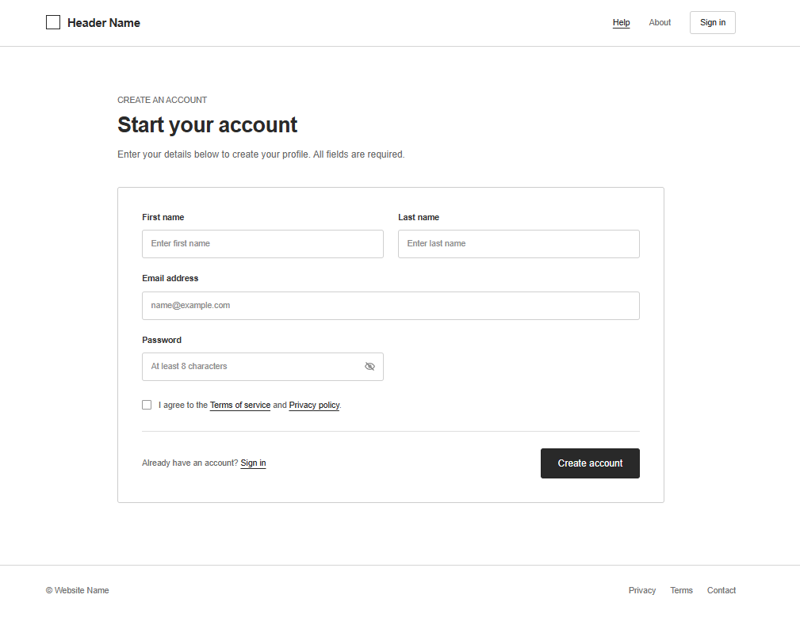
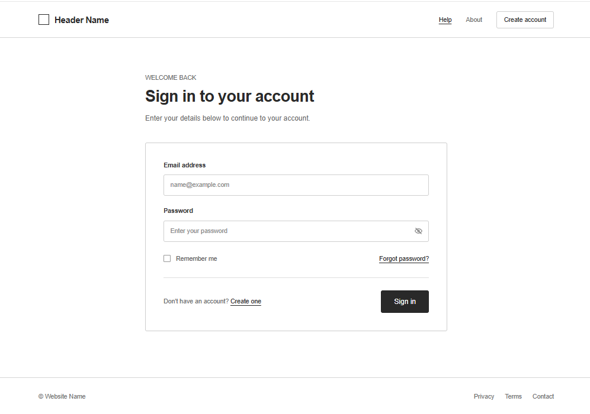
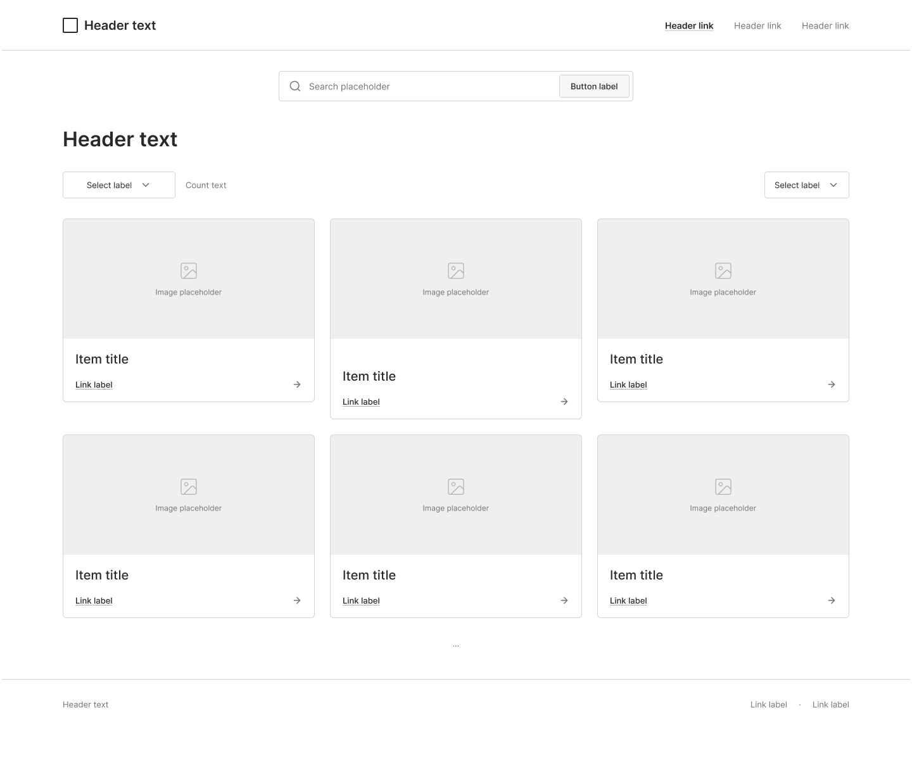
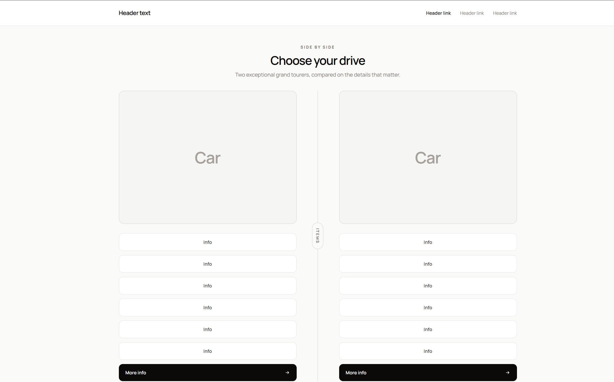
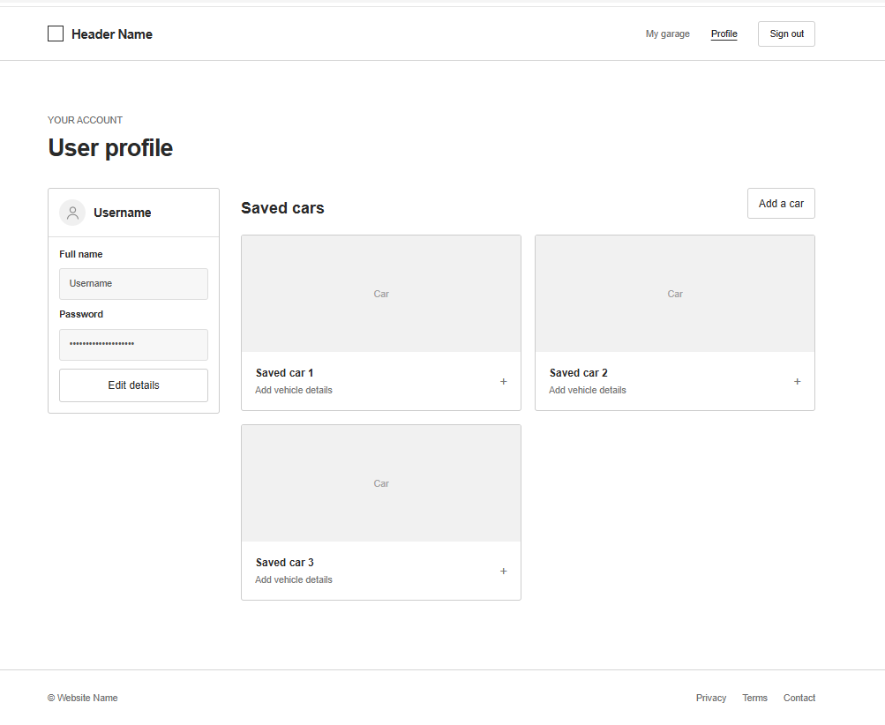

# AutoVault
## Data source
API https://vpic.nhtsa.dot.gov/api/
```
Json Example
          {
            "success": true,
            "data": {
              "vin": "1FTEW1EF3GKE12345",
              "make": "FORD",
              "model": "F-150",
              "year": 2016,
              "engine": "3.5L V6",
              "Transmission": "eCVT",
              "bodyClass": "Pickup",
            }
          }
```
## Elevator Pitch
Our project is a vehicle specification web application that allows users to quickly search for detailed information on various cars. Designed for car enthusiasts, students, and prospective buyers, the app provides technical specifications such as the VIN, make, model, year, engine size, transmission type and body style in an easy to navigate interface. By organizing reliable vehicle data into a simple and responsive website users can quickly compare and learn about different vehicles without having to search across multiple platforms. 
## Future Plan
### Baseline Features
Four  HTML pages that let users travel between the home screen, user profiles, and a car page complete with sample vehicles.
### Vertical Slices
  Dylan: Main home page
  
  Evan: Comparison tool
  
  Ramisa: User Profile and Reviews
  
  Zarrar: Car Detail page
  
## Comparisons
https://www.automobile-catalog.com/ \
https://www.autoevolution.com/cars/

Unlike platforms like Automobile-Catalog and AutoEvolution, which are feature dense, text-driven directory layouts that feel outdated- especially on smaller devices, our project prioritizes a modern, user-friendly experience centered on clean visual design and seamless mobile responsiveness. We will extend the capabilities of these websites that allows users to directly compare two or more vehicles such as dimensions, performance metrics and more.

## Wireframes









